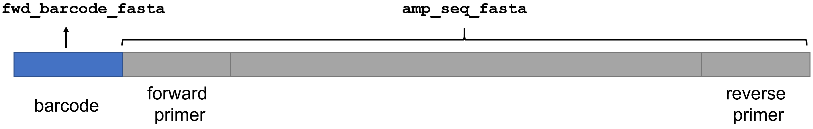
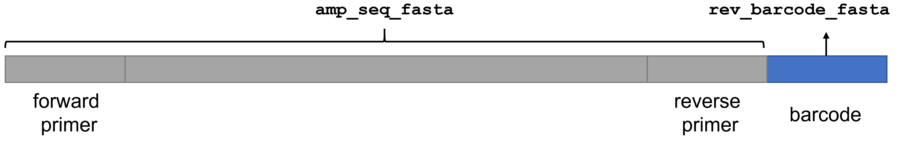

# AmpBinner
A barcode demultiplexer for Oxford Nanopore long-read amplicon sequencing data. 

## Features
- AmpBinner uses the sequence upstream/downstream of the barcode to help locate barcode position and eliminates random matching due to sequencing error.
- AmpBinner does not require a pretrained model for demultiplexing and supports officially provided barcodes as well as custom-designed barcodes.
- AmpBinner is able to demultiplex Oxford Nanopore sequencing data generated from **10X Genomics Chromium single cell libraries**. 

## <a name="Requirements"></a>Requirements
- Operating system: Linux or macOS
- [Python](https://www.python.org/) 2.7 or later
- [minimap2](https://github.com/lh3/minimap2) 2.8 or later

## <a name="Installation"></a>Installation

AmpBinner calls `minimap2` to do sequence alignment. If you don't have `minimap2` in you system, you can install it following the instructions [here](https://github.com/lh3/minimap2#install).  
If you are using Linux, you can acquire precompiled binaries using the following commands:

```
wget https://github.com/lh3/minimap2/releases/download/v2.17/minimap2-2.17_x64-linux.tar.bz2
tar -jxvf minimap2-2.17_x64-linux.tar.bz2
./minimap2-2.17_x64-linux/minimap2
```

Next, you can clone the repository of AmpBinner using the following command.
```
git clone https://github.com/WGLab/AmpBinner.git
```
The scripts in the `./AmpBinner` can run directly without additional compilation or installation.

## <a name="Usage"></a>Usage

There are two script files in the `AmpBinner` directory. `ampBinner_10X.py` is used to demultiplex Oxford Nanopore sequencing data derived from 10X Genomics Chromium single cell libraries. There are usually tens of thousands of barcodes per sample.  `ampBinner.py` is for regular barcoding methods, including barcoding kits provided by Oxford Nanopore Technologies and custom-designed barcodes.

### Demultiplexing regular amplicons

```
$ ./ampBinner.py --help 
usage: ampBinner.py [-h] [--in_fq FILE] [--in_fq_list FILE] --amp_seq_fasta
                    FILE --out_dir PATH --exp_name STRING
                    [--fwd_barcode_fasta FILE] [--rev_barcode_fasta FILE]
                    [--require_two_barcodes] [--num_threads INT]
                    [--minimap2 FILE] [--version]

A barcode demultiplexer for Oxford Nanopore long-read sequencing data

optional arguments:
  -h, --help            show this help message and exit
  --in_fq FILE          input sequencing reads in one FASTQ(.gz) file
  --in_fq_list FILE     a list file specifying all input FASTQ(.gz) files, one
                        file per line
  --amp_seq_fasta FILE  reference amplicon sequence in FASTA format
  --out_dir PATH        output directory
  --exp_name STRING     experimental name, used as prefix of output files
  --fwd_barcode_fasta FILE
                        barcode sequences of the forward primer (in FASTA
                        format)
  --rev_barcode_fasta FILE
                        barcode sequences of the reverse primer (in FASTA
                        format)
  --require_two_barcodes
                        require matched barcodes on both ends (default:
                        False). Notice: this option is valid only if both '--
                        fwd_barcode_fasta' and '--rev_barcode_fasta' are
                        supplied.
  --num_threads INT     number of threads (default: 1)
  --minimap2 FILE       path to minimap2 (default: using environment default)
  --version             show program's version number and exit

```
If you have one single input fastq file, you can supply the input with `--in_fq`. 
If you have multiple fastq files, you can supply a list file with `--in_fq_list`. The list file contains all input fastq files, one file per line. 

`--amp_seq_fasta` is the reference amplicon sequence in FASTA format. Sometimes the barcode sequence is not at the very begining of the long read. Sometimes the first a few bases of a read is truncated. Due to the sequencing error, the barcode matching is flexible and allows some mismatches. **`ampBinner.py` assumes the reference amplicon sequence is known and uses it to distinguish amplicon sequence and barcode sequence, thus eliminates random fuzzy matching inside the amplicon.** 

`--fwd_barcode_fasta` and `--rev_barcode_fasta` are barcode sequences in FASTA format. If you use the same barcodes on both ends, you can supply `--fwd_barcode_fasta` and `--rev_barcode_fasta` with the same file. An example of `--fwd_barcode_fasta` is shown below. We supplied FASTA files of official barcodes in the `AmpBinner/ONT_barcodes` folder.  

```
>NB01
CACAAAGACACCGACAACTTTCTT
>NB02
ACAGACGACTACAAACGGAATCGA
>NB03
CCTGGTAACTGGGACACAAGACTC
>NB04
TAGGGAAACACGATAGAATCCGAA
>NB05
AAGGTTACACAAACCCTGGACAAG
>NB06
GACTACTTTCTGCCTTTGCGAGAA
>NB07
AAGGATTCATTCCCACGGTAACAC
>NB08
ACGTAACTTGGTTTGTTCCCTGAA
>NB09
AACCAAGACTCGCTGTGCCTAGTT
>NB10
GAGAGGACAAAGGTTTCAACGCTT
>NB11
TCCATTCCCTCCGATAGATGAAAC
>NB12
TCCGATTCTGCTTCTTTCTACCTG
```

`ampBinner.py` supports different barcoding strategies.  
#### Case 1. If you only add barcodes on forward primer

In this case, the amplicon structure is shown below. 
<p align="center"></p>

You can use the `--fwd_barcode_fasta` argument to supply the barcode FASTA file and use the `--amp_seq_fasta` argument to supply reference amplicon FASTA file. Please note that **the `--amp_seq_fasta` file should INCLUDE the primer sequence but EXCLUDE the barcode sequence**.  An example command is shown below: 

```
/home/fangl/AmpBinner/ampBinner.py --in_fq example_data.fastq.gz --amp_seq_fasta example_amplicon_seq.fasta --out_dir . --exp_name testing --num_threads 4 --fwd_barcode_fasta example_barcodes.fasta --minimap2 /home/fangl/software/minimap2-2.8_x64-linux/minimap2
```

#### Case 2. If you only add barcodes on reverse primer
In this case, the amplicon structure is shown below. 
<p align="center"></p>

Similar to case 1, you can use the `--rev_barcode_fasta` argument to supply the barcode FASTA file and use the `--amp_seq_fasta` argument to supply reference amplicon FASTA file. Please note that **the `--amp_seq_fasta` file should INCLUDE the primer sequence but EXCLUDE the barcode sequence**.  An example command is shown below: 

```
/home/fangl/git_repo/push/AmpBinner/ampBinner.py --in_fq example_data.fastq.gz --amp_seq_fasta example_amplicon_seq.fasta --out_dir . --exp_name testing --num_threads 4 --rev_barcode_fasta example_barcodes.fasta --minimap2 /mnt/isilon/wang_lab/fangli/software/minimap2-2.8_x64-linux/minimap2
```


### Demultiplexing 10X Genomics Chromium single cell libraries


